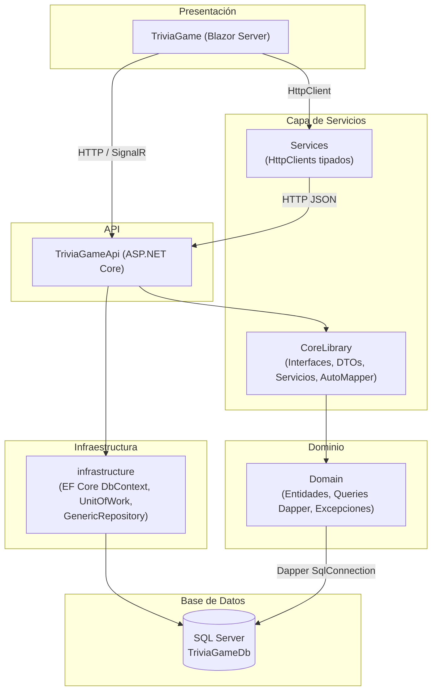
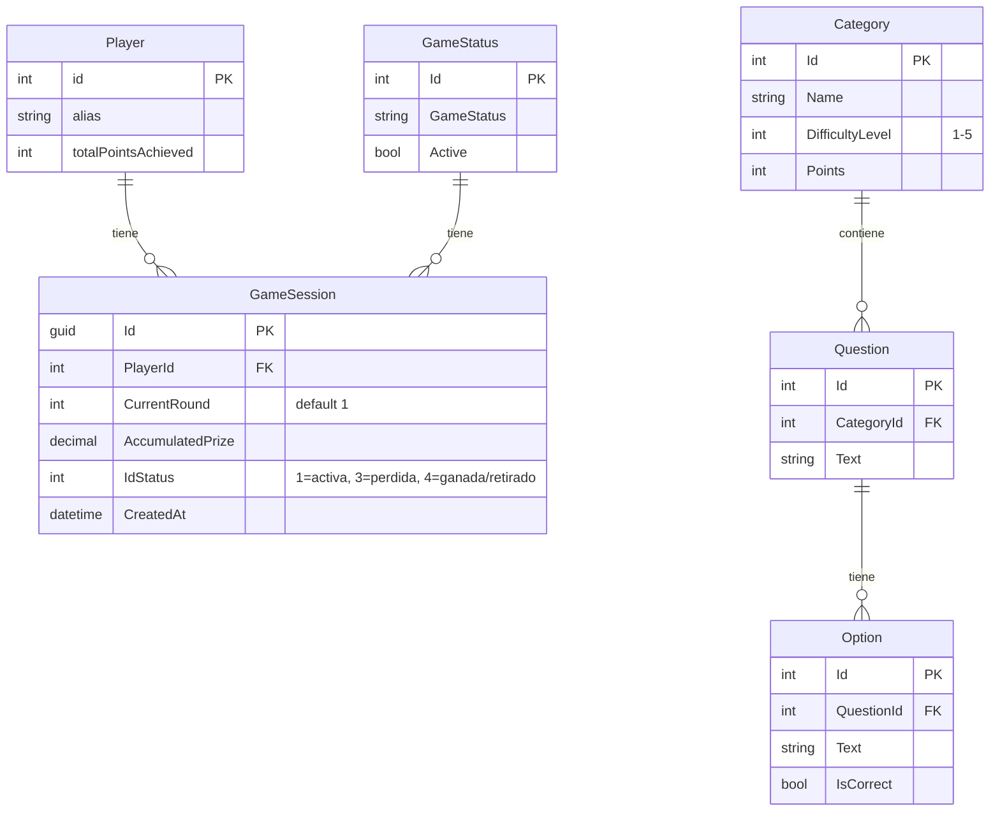
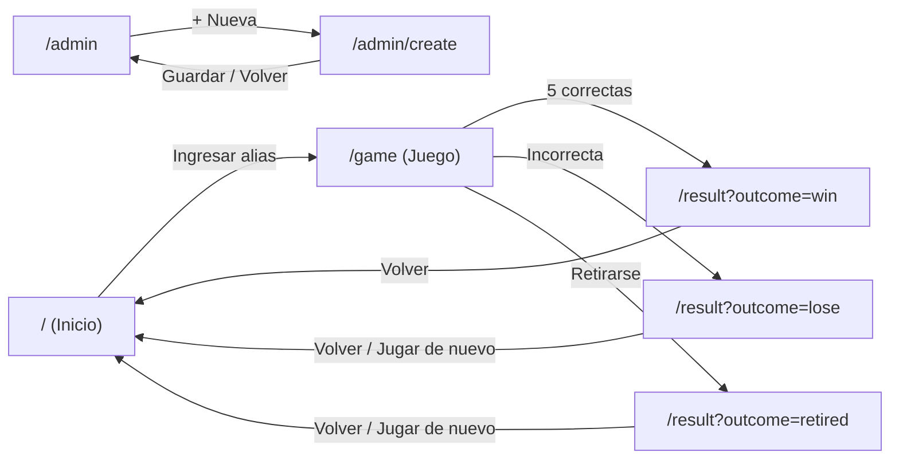
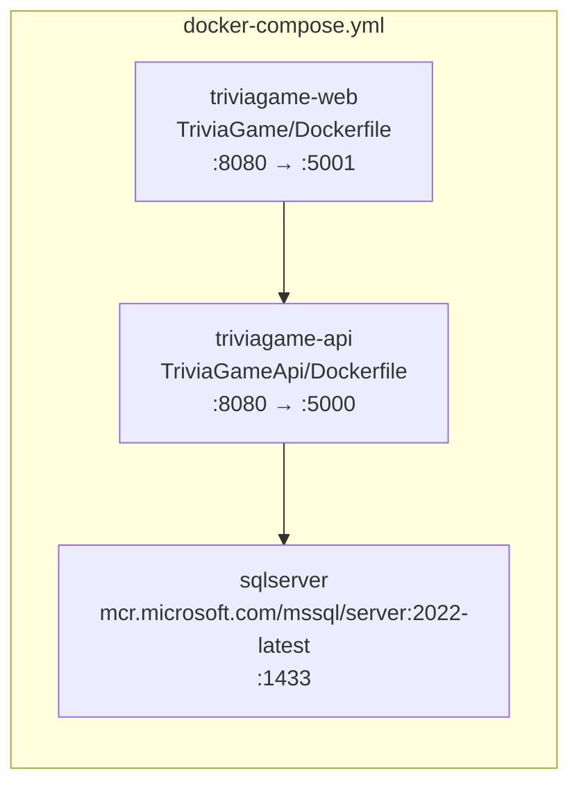

# TriviaGame 🧠

Juego de preguntas y respuestas de **5 rondas con dificultad creciente**. Construido con **.NET 8**, **Blazor Server** + **Web API** + **SQL Server**.

---

## 📐 Arquitectura



### Decisiones arquitectónicas

| Decisión | Justificación |
|---|---|
| **Arquitectura por capas** | Separa responsabilidades (presentación, API, servicios, dominio, infraestructura). `CoreLibrary` se reutiliza entre API y los HttpClients del Blazor. |
| **Blazor Server** | Interactividad en tiempo real sin exponer lógica de negocio al cliente. La comunicación vía SignalR evita duplicar validaciones. |
| **EF Core + Dapper (híbrido)** | **EF Core** para escrituras transaccionales vía `UnitOfWork`/`GenericRepository`. **Dapper** para lecturas optimizadas (preguntas aleatorias, scoreboards) donde EF añadiría overhead innecesario. |
| **Response\<T\> wrapper** | Envoltura genérica con `Succeeded`, `Message` y `Data` que unifica el manejo de errores en toda la cadena: servicio → controlador → HttpClient → Blazor. |
| **Sin Migrations EF** | El esquema se gestiona externamente mediante `script/Backup.sql`. Esto facilita el despliegue en Docker (el contenedor SQL ejecuta el script al arrancar) y mantiene compatibilidad con DBA. |
| **AutoMapper** | Centraliza el mapeo DTO ↔ Entity en profiles, evitando mapeos manuales dispersos. |
| **HttpClients tipados** | Cada interfaz de cliente (`IAdminHttpClient`, `IGameSessionHttpClient`, `IPlayerHttpClient`) tiene su propia implementación con `HttpClient` inyectado, registrada vía `AddHttpClient<T>`. |
| **DbContext dinámico** | `ServiceContext` escanea automáticamente el ensamblado `Domain` en busca de clases que implementen `IEntity`, eliminando la necesidad de declarar `DbSet<T>` manualmente. |

---

## 🗄️ Modelo de Dominio / Entidad-Relación



📄 **Script de base de datos:** [`script/Backup.sql`](script/Backup.sql) — crea la base de datos `TriviaGameDb` con todas las tablas, índices y datos iniciales.

🔧 **Diagrama editable:** [`docs/arquitectura.drawio`](docs/arquitectura.drawio) — 3 pestañas (Arquitectura, ERD, Casos de Uso).

---

## 🎯 Casos de Uso

| Actor | Caso de Uso | Descripción |
|---|---|---|
| **Jugador** | Iniciar partida | Ingresa un alias → el sistema crea o recupera el jugador → inicia una nueva sesión de juego |
| **Jugador** | Responder pregunta | Selecciona una de 4 opciones → envía la respuesta → recibe feedback inmediato (correcta/incorrecta) |
| **Jugador** | Retirarse | Abandona la partida voluntariamente y conserva el premio acumulado hasta ese momento |
| **Jugador** | Ver resultado | Pantalla final con el desenlace: 🏆 ganó, 💥 eliminado, 🚪 retirado — muestra ronda alcanzada y premio |
| **Admin** | Listar preguntas | Visualiza en una tabla todas las preguntas registradas con su nivel y opciones |
| **Admin** | Crear pregunta | Formulario para registrar una nueva pregunta con categoría, texto y 4 opciones (1 correcta) |

### Flujo de navegación



---

## 🛠️ Stack Tecnológico

| Tecnología | Versión | Uso |
|---|---|---|
| .NET | 8.0 (LTS) | Runtime base |
| Blazor Server | 8.0 | Interfaz de usuario interactiva |
| ASP.NET Core Web API | 8.0 | API REST para operaciones de administración |
| Entity Framework Core | 9.0 | ORM para escritura de datos |
| SQL Server | 2022+ | Base de datos relacional |
| Dapper | — | ORM ligero para lecturas optimizadas |
| AutoMapper | 16.1 | Mapeo DTO ↔ Entity |
| Swashbuckle (Swagger) | 10.1 | Documentación interactiva de la API |
| Docker / docker-compose | — | Contenedores y orquestación |

---

## 🚀 Instalación y Configuración

### Local (sin Docker)

**Requisitos:**
- [.NET 8 SDK](https://dotnet.microsoft.com/download/dotnet/8.0)
- SQL Server 2022+ (Express, Developer o superior)
- SQL Server Management Studio (opcional)

**Pasos:**

1. **Clonar el repositorio**
   ```bash
   git clone <repo-url>
   cd TriviaGame.Solution
   ```

2. **Crear la base de datos**
   - Abre `script/Backup.sql` en SSMS o ejecuta con `sqlcmd`:
   ```bash
   sqlcmd -S "localhost\SQLEXPRESS" -i script/Backup.sql
   ```

3. **Configurar la conexión a la API**  
   Edita `TriviaGameApi/appsettings.json`:
   ```json
   "ConnectionStrings": {
     "DefaultConnection": "Server=localhost\\SQLEXPRESS;Database=TriviaGameDb;Trusted_Connection=True;MultipleActiveResultSets=true;TrustServerCertificate=True"
   }
   ```

4. **Configurar la URL de la API para el Blazor**  
   Edita `TriviaGame/appsettings.json`:
   ```json
   "ApiSettings": {
     "BaseUrl": "http://localhost:5268/"
   }
   ```
   > El puerto depende del perfil de lanzamiento. Revisa `Properties/launchSettings.json`.

5. **Ejecutar la API**
   ```bash
   dotnet run --project TriviaGameApi
   ```
   Swagger disponible en `http://localhost:5268/swagger`.

6. **Ejecutar el cliente Blazor**
   ```bash
   dotnet run --project TriviaGame
   ```
   Abrir en `https://localhost:5221` (o el puerto configurado).

---

### Docker

**Requisitos:**
- [Docker Desktop](https://www.docker.com/products/docker-desktop/)

**Pasos:**

1. **Construir las imágenes**
   ```bash
   docker compose build
   ```

2. **Iniciar los contenedores**
   ```bash
   docker compose up -d
   ```

3. **Acceder**
   | Servicio | URL |
   |---|---|
   | Blazor (TriviaGame) | [http://localhost:5001](http://localhost:5001) |
   | API (TriviaGameApi) | [http://localhost:5000](http://localhost:5000) |
   | Swagger | [http://localhost:5000/swagger](http://localhost:5000/swagger) |
   | SQL Server | `localhost:1433` (sa / TriviaGame@123) |

4. **Detener**
   ```bash
   docker compose down
   ```

**Arquitectura Docker:**



> El contenedor SQL ejecuta `sqlserver/init-db.sh` al arrancar, que espera a que SQL Server esté listo y luego ejecuta `script/Backup.sql` para crear el esquema automáticamente.

---

## 📡 Endpoints de la API

| Método | Ruta | Controlador | Descripción |
|---|---|---|---|
| `GET` | `api/admin/categories` | Admin | Lista todas las categorías |
| `POST` | `api/admin/questions` | Admin | Crea una pregunta con opciones |
| `GET` | `api/admin/questions` | Admin | Lista todas las preguntas (admin) |
| `GET` | `Category/GetAll` | Category | Lista todas las categorías |
| `POST` | `GameSession/StartGame` | GameSession | Inicia una nueva partida |
| `GET` | `GameSession/GetNextQuestion/{sessionId}` | GameSession | Obtiene la siguiente pregunta |
| `POST` | `GameSession/SubmitAnswer` | GameSession | Envía la respuesta del jugador |
| `POST` | `GameSession/Withdraw` | GameSession | Retira al jugador de la partida |
| `POST` | `GameSession/EndGame` | GameSession | Finaliza la partida |
| `GET` | `GameSession/GetById/{sessionId}` | GameSession | Obtiene datos de la sesión |
| `POST` | `Player/Register` | Player | Registra un nuevo jugador |
| `POST` | `Player/EnterGame` | Player | Obtiene o crea jugador por alias |
| `GET` | `Player/GetById/{id}` | Player | Obtiene jugador por ID |
| `POST` | `Question/Create` | Question | Crea una pregunta |
| `GET` | `Question/GetAll` | Question | Lista todas las preguntas |
| `GET` | `Scoreboard/GetTop` | Scoreboard | Top 10 puntuaciones |

---

## 📁 Estructura del Proyecto

```
TriviaGame.Solution/
├── TriviaGameApi/               # ASP.NET Core Web API
│   ├── Controllers/             # 6 controladores REST
│   ├── Program.cs               # Punto de entrada y DI
│   └── Dockerfile
├── TriviaGame/                  # Blazor Server
│   ├── Components/
│   │   ├── Layout/              # MainLayout (nav + body)
│   │   └── Pages/
│   │       ├── StartGame.razor  # Landing page
│   │       ├── Game.razor       # Juego activo
│   │       ├── Result.razor     # Pantalla de resultado
│   │       └── Admin/           # Admin pages
│   ├── Program.cs
│   ├── ServiceRegistration.cs   # Registro de HttpClients
│   └── Dockerfile
├── CoreLibrary/                 # Capa de servicios compartida
│   ├── DTOs/                    # Request / Response models
│   ├── Features/                # Implementaciones de servicios
│   ├── Interface/
│   │   ├── Services/            # Interfaces de servicios + clientes
│   │   └── Repositories/        # IUnitOfWork, IGenericRepository
│   ├── Mappings/                # Perfiles de AutoMapper
│   ├── Wrappers/                # Response<T>
│   └── ServiceRegistration.cs
├── Domain/                      # Capa de dominio
│   ├── Common/                  # IEntity (marcador)
│   ├── Entities/                # Player, GameSession, Category, Question, Option
│   ├── Exceptions/              # InfrastructureException
│   └── Querys/                  # SqlQueries, IQueryService, QueryService (Dapper)
├── infrastructure/infrastructure/  # Capa de infraestructura
│   ├── Setting/                 # ServiceContext (DbContext)
│   ├── Repositories/            # UnitOfWork, GenericRepository
│   ├── Extensions/              # ValidateNullEntity
│   └── ServiceRegistration.cs
├── Services/                    # HttpClient tipados para Blazor
│   ├── Common/                  # BaseHttpClient
│   └── Http/                    # AdminHttpClient, GameSessionHttpClient, PlayerHttpClient
├── script/
│   └── Backup.sql               # Esquema completo de BD
├── sqlserver/
│   └── init-db.sh               # Script de inicialización Docker
├── docker-compose.yml
├── .dockerignore
└── README.md
```

---

## 📋 Preguntas Técnicas

Análisis y soluciones a 5 problemas comunes en el ecosistema .NET, abordados desde una perspectiva técnica y de ingeniería:

| # | Problema | Tema principal |
|---|---|---|
| 1 | Latencia en integración al final de la tarde | Polly, Circuit Breaker, Bulkhead |
| 2 | Reporte matutino colapsa la BD | CQRS, Columnstore, ETL nocturna |
| 3 | Sistema contable multi-país | Strategy, Plugin Architecture, Modular Monolith |
| 4 | 80+ clientes con parches costosos | CI/CD, FluentMigrator, Azure Arc, Air-gap |
| 5 | Kiosko con transacciones incompletas | Saga Pattern, Idempotency Key, Offline-first |

👉 Ver el documento completo en [`docs/preguntas-tecnicas.md`](docs/preguntas-tecnicas.md)