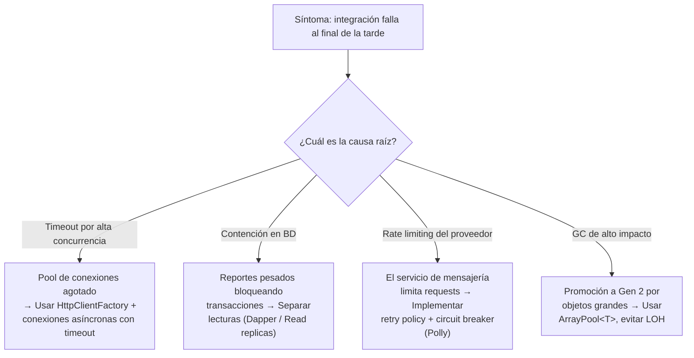
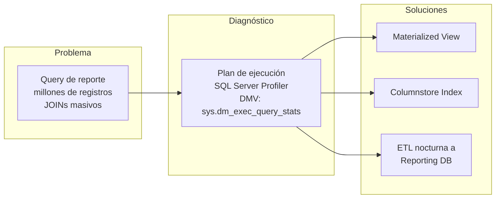
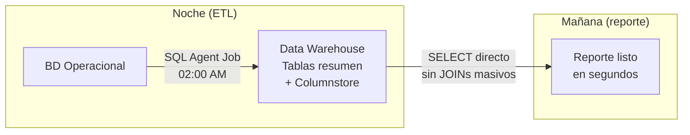
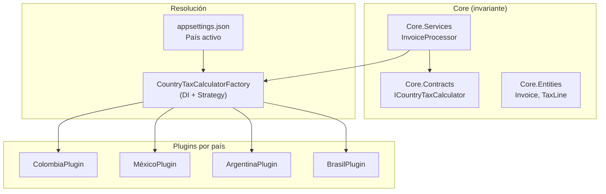
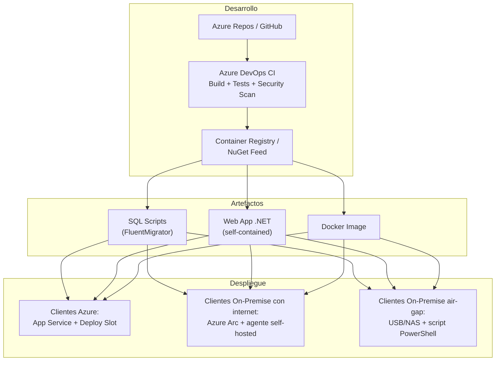
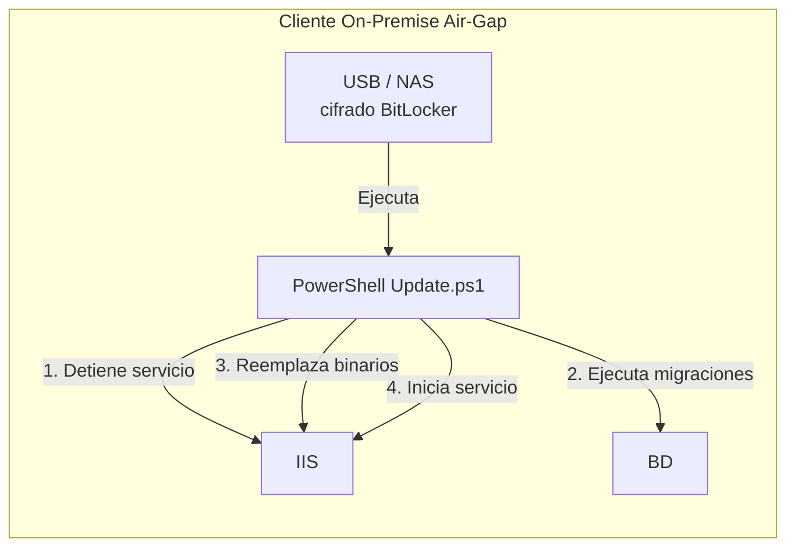
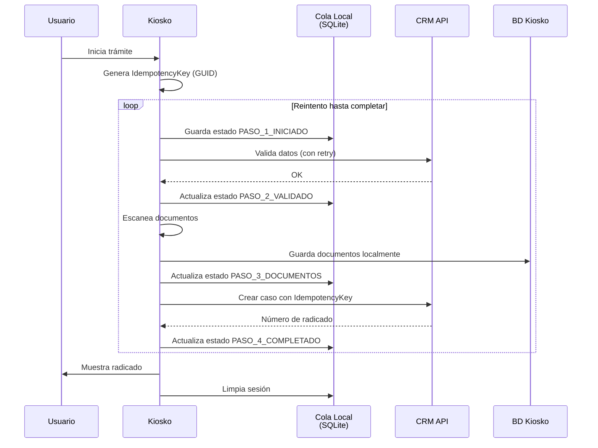
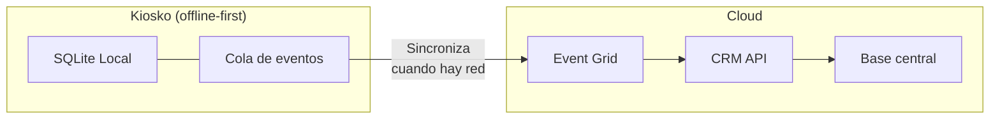

# Preguntas Técnicas - Análisis y Soluciones

Documento de respuestas a problemas dirigidos a lenjuaje .NET . Incluye diagramas, tablas de diagnóstico, fragmentos de código y justificación técnica y de ingeniería.

---

## Pregunta 1: Latencia en integración con mensajería instantánea al final de la tarde

### Diagnóstico

| Fase | Acción | Herramientas |
|---|---|---|
| **Monitoreo** | Identificar si es problema de recursos (CPU, RAM, IO, red) o de lógica | `dotnet-counters`, PerfMon, Azure Metrics |
| **Trazas distribuidas** | Rastrear tiempo de cada llamada: API → BD → servicio de mensajería | OpenTelemetry, Application Insights, Serilog + Seq |
| **Análisis de contención** | Detectar bloqueos por hilos / base de datos al final del día | `dotnet-dump`, WinDbg, SQL Server Activity Monitor |
| **Logging diferencial** | Comparar logs de la mañana vs. 5-6 PM | Elastic Stack (ELK), structured logging con Serilog |
| **Prueba de carga** | Replicar el pico de la tarde en ambiente controlado | k6, NBomber, JMeter |



### Solución técnica

```csharp
// Patrón: Circuit Breaker + Retry + Timeout con Polly
services.AddHttpClient<IMessagingClient, MessagingClient>()
    .AddPolicyHandler(Policy
        .Handle<TimeoutException>()
        .OrTransientHttpError()
        .CircuitBreakerAsync(
            handledEventsAllowedBeforeBreaking: 3,
            durationOfBreak: TimeSpan.FromSeconds(30)))
    .AddPolicyHandler(Policy.TimeoutAsync<HttpResponseMessage>(5));
```

### Vista de ingeniería

Implementar **Bulkhead pattern** para aislar la integración de mensajería del resto del sistema, y **Queue-based load leveling** usando Azure Service Bus o RabbitMQ para desacoplar el envío síncrono. Esto evita que picos de mensajería afecten las transacciones principales y viceversa.

---

## Pregunta 2: Reporte matutino colapsa la base de datos

### Diagnóstico



### Acciones inmediatas (corto plazo)

| # | Acción | Impacto |
|---|---|---|
| 1 | Habilitar `SNAPSHOT ISOLATION` para evitar bloqueos en tablas transaccionales | Medio |
| 2 | Crear **índices cubrientes** para las tablas más consultadas en el reporte | Alto |
| 3 | Mover la ejecución del reporte a un **AlwaysOn Readable Secondary** | Alto |

### Solución definitiva (mediano plazo)



### Vista de ingeniería

Implementar un modelo **CQRS** donde el reporte no consulta la base operacional sino un **Data Warehouse** actualizado por un job nocturno. Las tablas de hecho usan **Columnstore Index** para compresión y velocidad analítica. Las consultas se hacen con **Dapper** en vez de EF Core para evitar overhead de materialización.

```sql
-- Tabla resumen creada por job nocturno
CREATE TABLE dbo.ResumenDiarioRegistraduria (
    Fecha DATE NOT NULL,
    CodigoRegistraduria VARCHAR(10) NOT NULL,
    TotalTransacciones INT,
    TotalCiudadanos INT,
    TiempoPromedioSegundos DECIMAL(10,2),
    INDEX IX_Columnstore CLUSTERED COLUMNSTORE
);
```

---

## Pregunta 3: Sistema contable multi-país con diferentes normas fiscales

### Arquitectura propuesta



### Patrones aplicados

| Patrón | Propósito |
|---|---|
| **Strategy Pattern** | Cada país implementa `ICountryTaxCalculator` con su lógica de impuestos |
| **Plugin Architecture** | Módulos por país como assemblies separados, cargados vía `AssemblyLoadContext` |
| **Factory + DI** | `CountryTaxCalculatorFactory` resuelve el calculador según configuración |
| **Chain of Responsibility** | Impuestos en cadena (IVA → retención → ICA, etc.) |
| **Feature Flags** | Activar/desactivar normas sin desplegar código |

### Solución técnica

```csharp
// Core - invariante
public interface ICountryTaxCalculator
{
    string CountryCode { get; }
    Task<TaxResult> CalculateAsync(Invoice invoice);
}

// Plugin Colombia
public class ColombiaTaxCalculator : ICountryTaxCalculator
{
    public string CountryCode => "CO";
    public async Task<TaxResult> CalculateAsync(Invoice invoice)
    {
        // Lógica específica: IVA 19%, Retefuente, ICA
    }
}

// Factory con DI dinámica
public class CountryTaxCalculatorFactory
{
    private readonly IEnumerable<ICountryTaxCalculator> _calculators;
    
    public ICountryTaxCalculator GetCalculator(string countryCode)
        => _calculators.First(c => c.CountryCode == countryCode);
}
```

### Vista de ingeniería

Implementar **modular monolith** donde cada país es un módulo independiente en su propio assembly. Si la escala lo justifica (20+ países), migrar a **microservicios** con un servicio contable por país y un API Gateway (Recomendable usar Ocelot). Usar **Database-per-tenant** con esquema por país para flexibilidad fiscal total sin acoplar estructuras de datos.

---

## Pregunta 4: 80+ clientes on-premise + Azure con parches costosos

### Arquitectura de despliegue



### Estrategia por tipo de cliente

| Escenario | Despliegue | Actualización BD | SSL |
|---|---|---|---|
| **Azure con internet** | Azure DevOps → Deploy Slot (zero-downtime) | Migraciones automáticas en startup | Managed Certificate + Key Vault |
| **On-premise con internet** | Agente self-hosted o Azure Arc | Ejecución vía script PowerShell | Let's Encrypt o CA interna |
| **On-premise sin internet** | USB/NAS cifrado con paquete NuGet + script | Script SQL versionado manual | Certificado auto-firmado CA distribuido por GPO |

### Solución técnica: migraciones de base de datos versionadas

```csharp
// FluentMigrator - funciona sin EF Core
[Migration(20250101)]
public class AddSecurityPatch : Migration
{
    public override void Up()
    {
        Execute.Sql(@"
            ALTER TABLE Users ADD MFAEnabled BIT NOT NULL DEFAULT 0;
            UPDATE Users SET MFAEnabled = 1 WHERE Role = 'Admin';
        ");
    }
    public override void Down() { }
}
```



### Vista de ingeniería

Migrar la arquitectura a **contenedores** (Docker + K3s para on-premise ligero) para que el despliegue sea idéntico en todos los entornos. Usar **GitOps** (Flux/ArgoCD) para entornos con conectividad y distribuir imágenes Docker comprimidas en tarball para entornos air-gapped. Centralizar la telemetría con **Azure Arc** para tener visibilidad de todos los clientes sin importar su infraestructura.

---

## Pregunta 5: Kiosko con transacciones incompletas por intermitencia de red

### Estrategia: Saga Pattern + Idempotency Key + Offline-First



### Componentes técnicos

| Componente | Tecnología | Propósito |
|---|---|---|
| **Idempotency Key** | `Guid` generado al inicio del trámite | El CRM rechaza duplicados con la misma key |
| **Cola de persistencia local** | SQLite embebido en el kiosko | Almacena el estado del trámite ante caídas de red |
| **Saga Orchestrator** | Máquina de estados con pasos compensables | Si falla el paso final, reintenta; si falla uno intermedio, compensa |
| **Outbox Pattern** | Tabla local `Outbox` con eventos | Cuando hay red, drena los eventos pendientes al CRM |

### Solución técnica: máquina de estados

```csharp
public enum TramiteStep
{
    INICIADO,
    VALIDADO_CRM,
    DOCUMENTOS_ESCANEADOS,
    CASO_CREADO,
    RADICADO_ENTREGADO
}

public class TramiteOrchestrator
{
    private readonly ILocalQueue _queue;
    private readonly ICrmClient _crm;
    
    public async Task<TramiteResult> ExecuteAsync(TramiteRequest request)
    {
        var key = Guid.NewGuid();
        
        // Verificar si existe un trámite en progreso
        var existing = await _queue.GetByKeyAsync(key);
        if (existing != null)
            return await ResumeAsync(existing); // Reanudar
        
        return await StartNewAsync(request, key);
    }
    
    private async Task<TramiteResult> ResumeAsync(TramiteState state)
    {
        switch (state.CurrentStep)
        {
            case TramiteStep.VALIDADO_CRM:
                return await EscanearDocumentos(state);
            case TramiteStep.DOCUMENTOS_ESCANEADOS:
                return await CrearCasoCRM(state);
            // ...
        }
    }
}
```

### Vista de ingeniería



Implementar **Offline-first architecture** donde el kiosko funciona completamente desconectado y sincroniza en segundo plano cuando recupera conectividad. Usar **Azure IoT Hub** para gestionar los dispositivos y **Event Grid** para el enrutamiento de eventos. La **Idempotency Key** es la pieza clave: al reanudar un trámite, el kiosko retoma desde el último paso persistido localmente, y el CRM rechaza duplicados porque ya procesó esa key.
